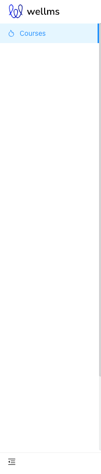
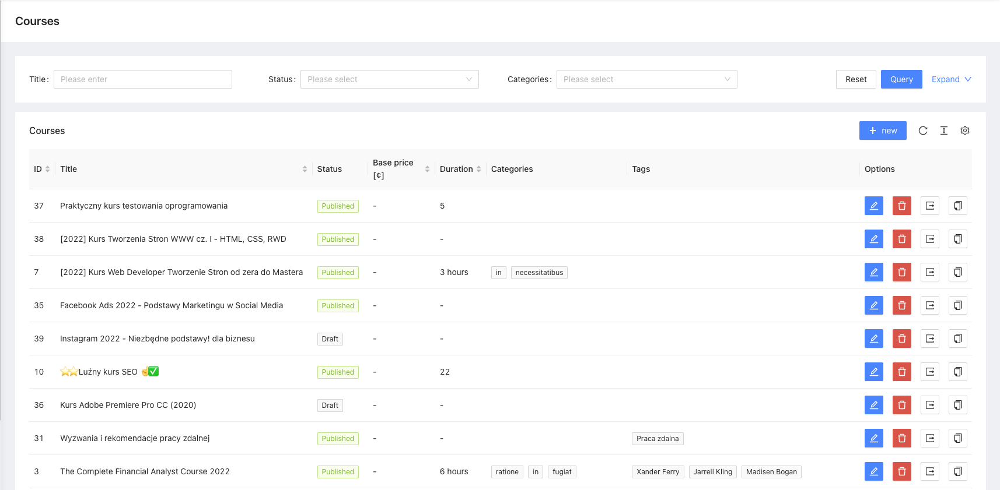
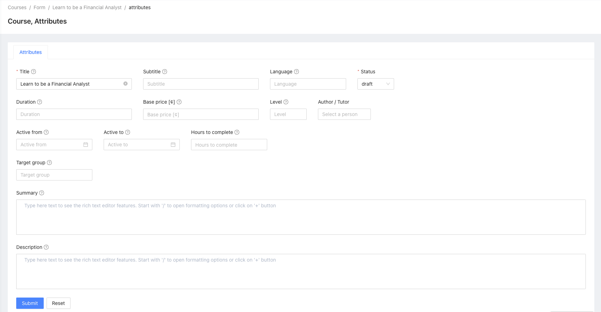

# Courses

Courses and content package

[](https://escolalms.github.io/Courses/)
[](https://codecov.io/gh/EscolaLMS/Courses)
[](https://github.com/EscolaLMS/Courses/actions/workflows/test.yml)
[](https://packagist.org/packages/escolalms/courses)
[](https://packagist.org/packages/escolalms/courses)
[](https://packagist.org/packages/escolalms/courses)
[](https://codeclimate.com/github/EscolaLMS/Courses/maintainability)

## What does it do

This package is used for creating Course for EscolaLms.

## Installing

- `composer require escolalms/courses`
- `php artisan migrate`
- `php artisan db:seed --class="EscolaLms\Courses\Database\Seeders\CoursesPermissionSeeder"`

## Schedule

- Schedules are available in ScheduleServiceProvider
  - `$schedule->job(CheckForDeadlines::class)->hourly()` - executed every hours
  - `$schedule->job(ActivateCourseJob::class)->daily()` - executed every days

## Endpoints

All the endpoints are defined in [](https://escolalms.github.io/Courses/)

## Tests

Run `./vendor/bin/phpunit  --filter 'EscolaLms\\Courses\\Tests'` to run tests. See [tests](tests) folder as it's quite good staring point as documentation appendix.

## Events

- `EscolaLms\Courses\Events\CourseAccessFinished` => Event is dispatched when users lost access to course.
- `EscolaLms\Courses\Events\CourseAccessStarted` => Event is dispatched when users received access to course.
- `EscolaLms\Courses\Events\CourseAssigned` => Event is dispatched when admin assigned access user.
- `EscolaLms\Courses\Events\CourseDeadlineSoon` => Event is dispatched when course deadline is coming out.
- `EscolaLms\Courses\Events\CoursedPublished` => Event is dispatched when course is published.
- `EscolaLms\Courses\Events\CourseFinished` => Event is dispatched when course is ended.
- `EscolaLms\Courses\Events\CourseStarted` => Event is dispatched when course is started.
- `EscolaLms\Courses\Events\CourseStatusChanged` => Event is dispatched when course has a status change.
- `EscolaLms\Courses\Events\CourseTutorAssigned` => Event is dispatched when tutor is assigned to course.
- `EscolaLms\Courses\Events\CourseTutorUnassigned` => Event is dispatched when tutor is unassigned to course.
- `EscolaLms\Courses\Events\CourseUnassigned` => Event is dispatched when user is unassigned to course.
- `EscolaLms\Courses\Events\TopicFinished` => Event is dispatched when course topic is finished.

### Admin panel

**Left menu**



**List of courses**



**Creating/editing course**



## Permissions

Permissions are defined in [seeder](vendor/escolalms/courses/database/seeders/CoursesPermissionSeeder.php)


## Model relation

The model user must be extended with the class HasCourses :

```
class User extends EscolaLms\Core\Models\User
{
    use HasCourses;
```

## Database relation

There is simple relation. [see docs for diagram](doc)

1. `Course` general category of the course
2. `Lesson` grouped by Course
3. `Topic` grouped by Lesson

```
Course 1 -> n Lesson
Lesson 1 -> n Topic
Topic 1 -> 1 TopicContent
```

`TopicContent` is an abstract model, this package contains some sample implementatio eg, `RichText`, `Audio`, `Video`, `H5P` and `Image`

You create any of the Content model by post to the same Topic endponit (create and update), [see docs examples](doc)

**Note** that `/api/topics` is using `form-data` - this is due to PHP nature of posting files

List of possible `TopicContent`s is availabe in the endpoint `/api/topics/types`

## Curriculum/Sylabus/Program

App user access the course by fetching `GET /api/courses/{id}/program` endpoint. This is after user purchase or has other access to the course. this endpoints renders tree of Course, Lessons, Topic with Contents essential to render whole course.

## Adding new `TopicContent` type

In the ServiceProvider register your class like

```php
use Illuminate\Support\ServiceProvider;
use EscolaLms\Courses\Facades\Topic;


class CustomServiceProvider extends ServiceProvider
{

    //...

    public function register()
    {
        Topic::registerContentClass(TopicContentCustom::class);
        // or
        Topic::registerContentClasses([TopicContentCustom::class, TopicAnotherContentCustom::class]);

        // also register JSON Resource for a type
        Topic::registerResourceClasses(Audio::class, [
            'client' => ClientAudioResource::class,
            'admin' => AdminAudioResource::class,
            'export' => ExportAudioResource::class,
        ]);

    }
}
```

see [EscolaLmsCourseServiceProvider.php](src/EscolaLmsCourseServiceProvider.php) as reference as well as [Models/TopicContent](package2/src/Models/TopicContent)

### Content

Package comes with seeder that create course with lessons and topics

```php
php artisan db:seed --class="\EscolaLms\Courses\Database\Seeders\CoursesSeeder"
```
