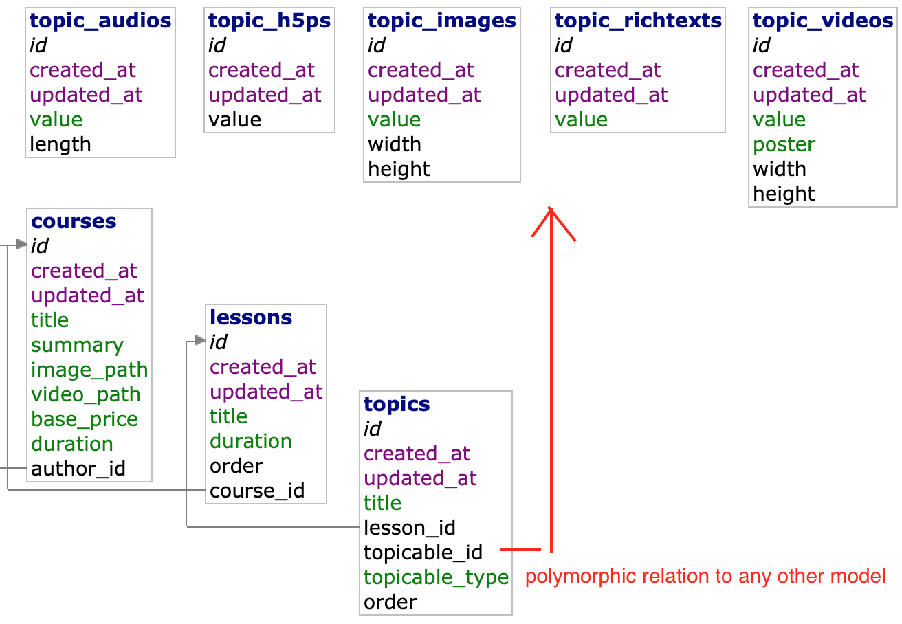
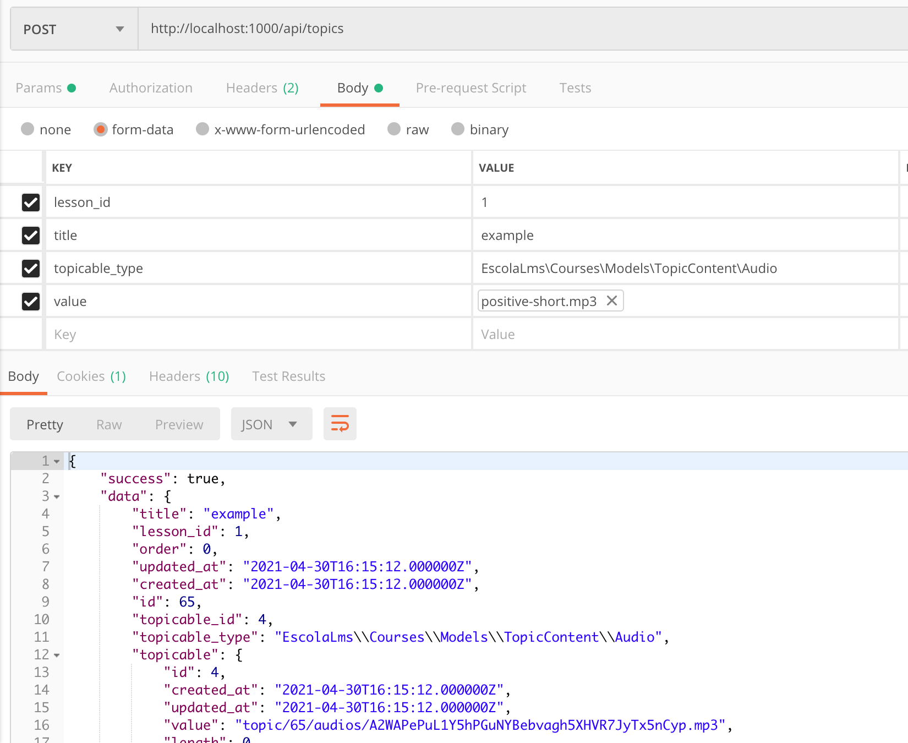
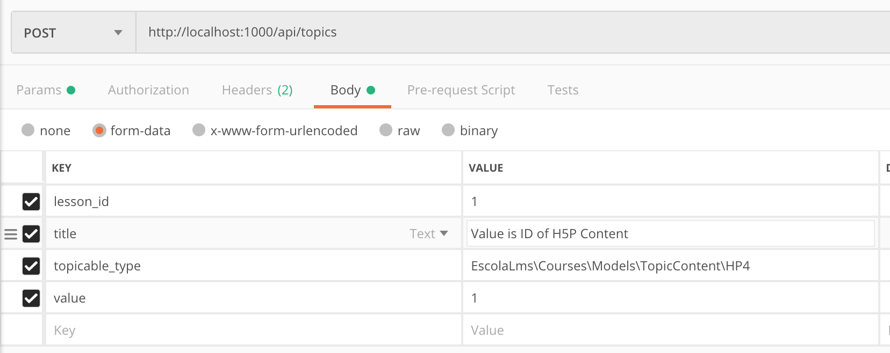
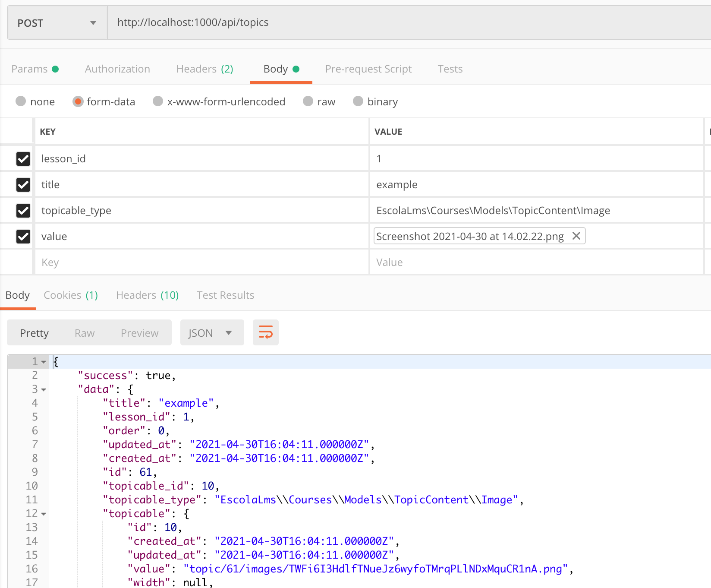
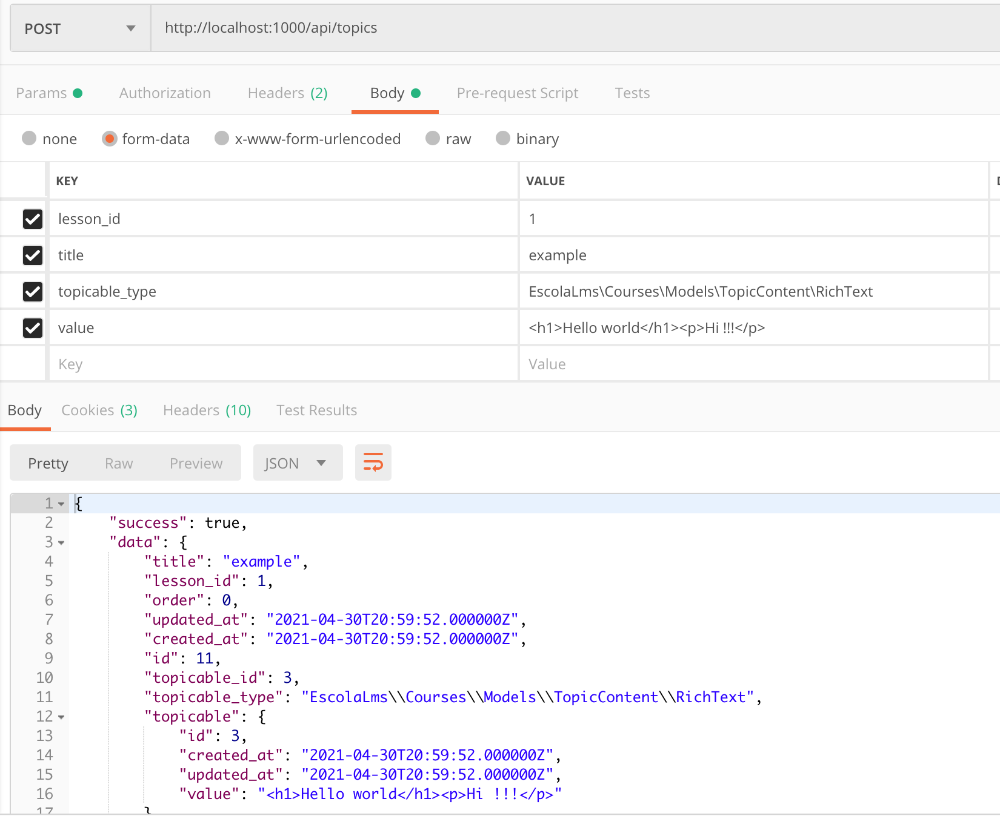
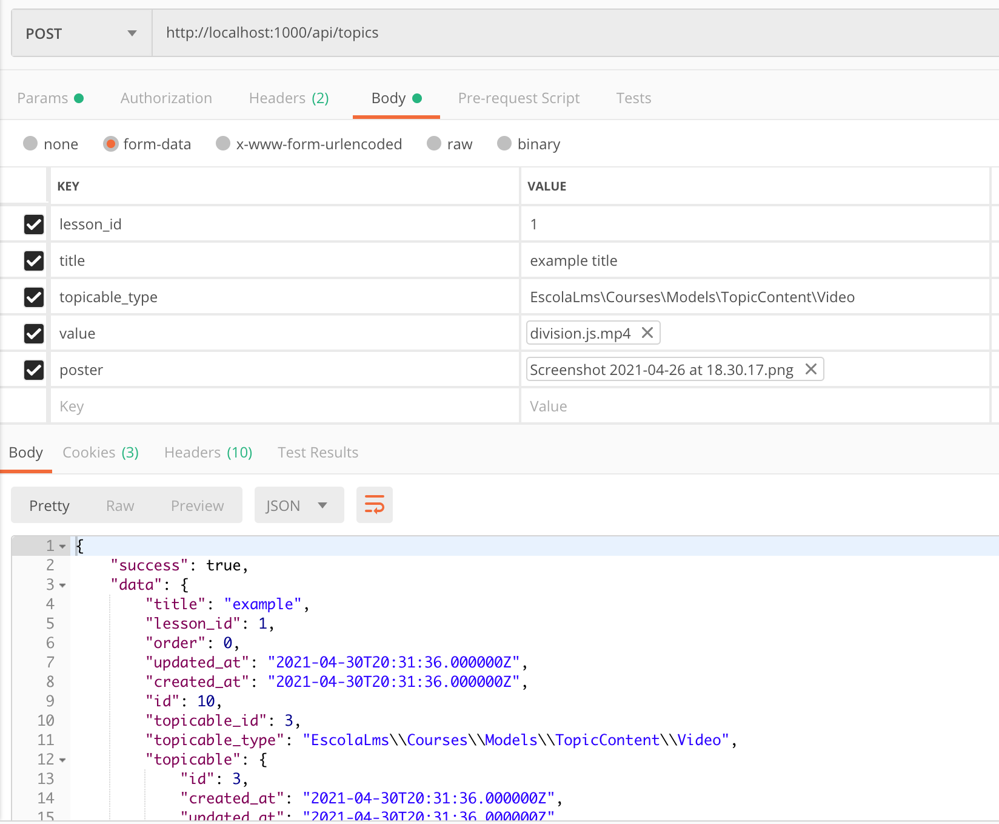
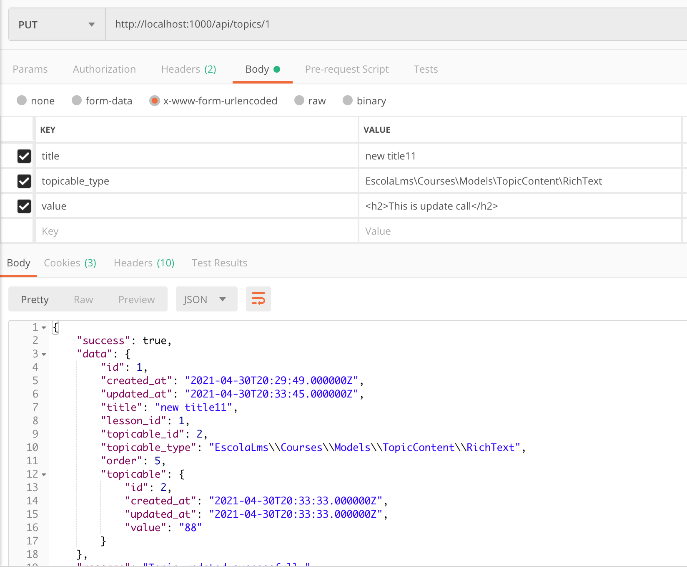

## Database tables relation

## Postman examples

### `POST` Create Audio

### `POST` Create H5P Content

### `POST` Create Image

### `POST` Create RichText

### `POST` Create Video

### `PUT` Update Content

